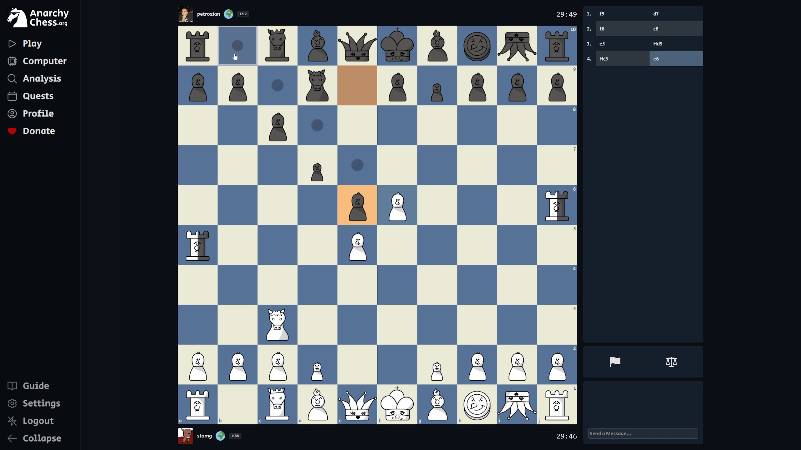
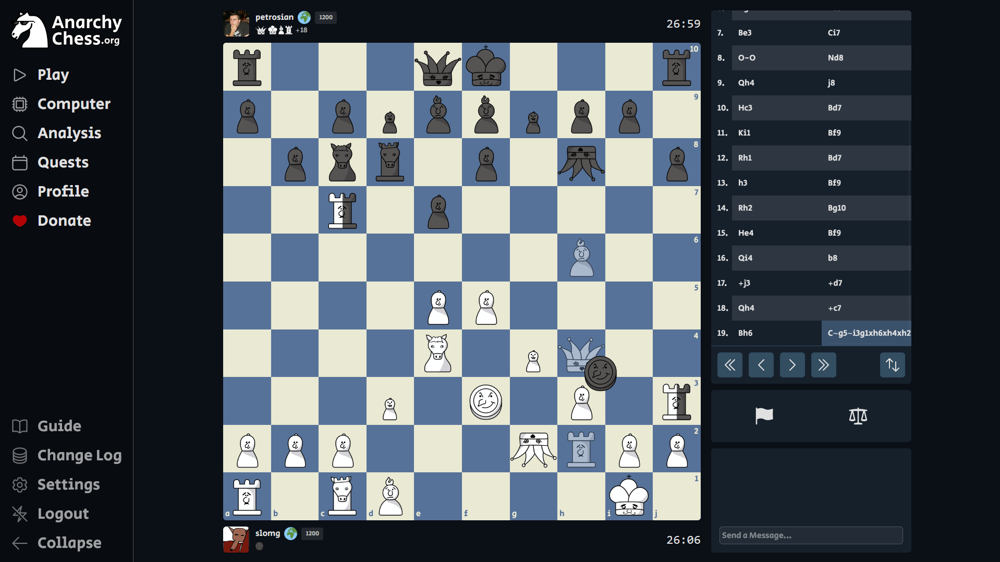
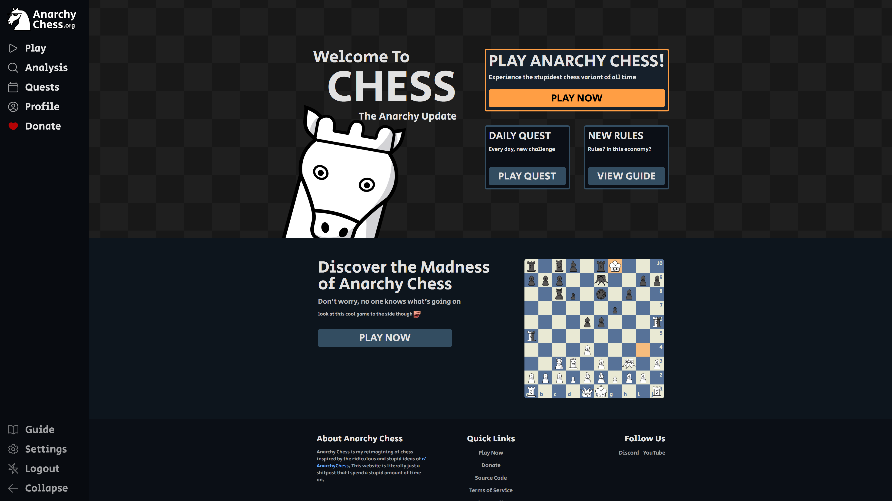
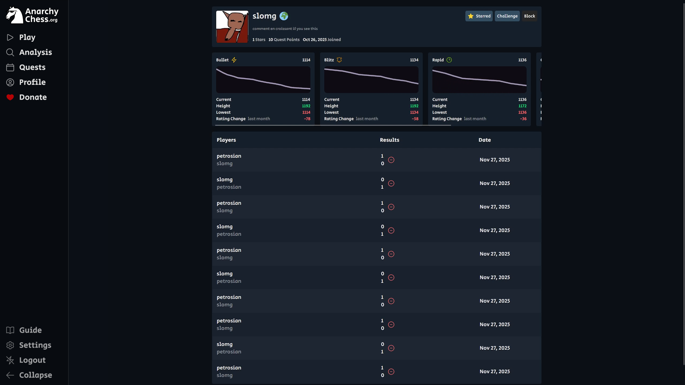

# Chess: The Anarchy Update

[Terms Of Service](https://anarchychess.org/tos) | [Privacy Policy](https://anarchychess.org/privacy) | [License](LICENSE)

[](https://discord.gg/qnkddndecq)

**Chess: The Anarchy Update** is a chess website that takes all the stupid ideas from [r/AnarchyChess](https://reddit.com/r/anarchychess) and turns them a real, balanced, chess variant.

# Features

- **New Pieces & Rules:** Knook, Checker, Traitor Rook, Antiqueen, Underage Pawn, King Capture, King Touch = Draw, Forced En Passant, Long Passant, Il Vaticano, Omnipotent Pawn, Vertical Castling, Knooklear Fusion, Queen Beta Decay.\
  _See the [full guide](https://anarchychess.org/guide) for detailed explanations of all pieces and rules_

- **Analysis:** Analysis board with branching positions and variations, available standalone or from finished games
- **Player Profiles:** Track ratings, game history and progress for each time control
- **Social Features:** Stars, blocks, in-game chat, leaderboards, direct challenges
- **Matchmaking:** Seek a game in any time control, all at once, rated or casual. Your seek is also displayed as an open seek, allowing players to accept it directly without having to go through the pool
- **Daily Quests:** Complete daily quests to climb the leaderboards and build a streak
- **Anarchy Bot:** A chess engine built from scratch. Supports playing against humans on the website with voice lines.

# Screenshots

<div>
    
    
    
    
</div>

# Tech Stack

- **Backend:** C# With ASP.NET Core, structured with Orleans
- **Frontend:** Next.js + Typescript, styled with Tailwind
- **Database & Storage:** Currently configured for PostgreSQL and Azure Blob Storage. Other SQL databases and blob storage providers can be used by installing the appropriate EF Core and FluentStorage packages.

# Anarchy Bot

Anarchy Bot is the AI used on Anarchy Chess, built from scratch.

- **Engine:** `AnarchyChess.Ai` handles move generation, search and position evaluation using bitboards. This is a compelte rewrite of the website's backend move generation, both exist because they serve different purposes, the backend generates moves with with a lot of metadata for frontend animation while the engine needs to compute moves as fast as possible.
- **Service:** `AnarchyChess.Ai.Service` is a thin gRPC wrapper that allows the website to request moves from the engine.
- **Deployment:** The bot runs on a separate VM so it doesn't compete with the backend for resources, and because it can be hosted on a spot VM, which makes computation a lot cheaper.

# Running Locally

## Backend Setup

1. Navigate to the backend directory

```bash
cd backend/AnarchyChess.Api
```

2. Restore dependencies

```bash
dotnet restore
```

3. Initialize & set secrets

```bash
dotnet user-secrets init

dotnet user-secrets set "AppSettings:Secrets:GoogleOAuth:ClientId" "<client-id>"
dotnet user-secrets set "AppSettings:Secrets:GoogleOAuth:ClientSecret" "<client-secret>"

dotnet user-secrets set "AppSettings:Secrets:DiscordOAuth:ClientId" "<client-id>"
dotnet user-secrets set "AppSettings:Secrets:DiscordOAuth:ClientSecret" "<client-secret>"

dotnet user-secrets set "AppSettings:Secrets:JwtSecret" "<jwt-secret>"

dotnet user-secrets set "AppSettings:Secrets:DatabaseConnString" "<connection-string>"
dotnet user-secrets set "AppSettings:Secrets:BlobStorageConnString" "<connection-string>"
dotnet user-secrets set "AppSettings:Secrets:RedisConnString" "<connection-string>"

dotnet user-secrets set "AppSettings:Secrets:TableCheckpointerConnString" "<connection-string>"
dotnet user-secrets set "AppSettings:Secrets:EventHubConnString" "<connection-string>"
dotnet user-secrets set "AppSettings:Secrets:EventHubName" "<connection-string>"
dotnet user-secrets set "AppSettings:Secrets:EventHubConsumerGroup" "<connection-string>"
```

4. Run the backend server

```bash
dotnet run
```

## Frontend Setup

1. Navigate to the frontend directory

```bash
cd frontend
```

2. Install dependencies

```bash
npm install
```

3. Setup environment variables

    Create a .env file:

```
NEXT_PUBLIC_API_URL="https://localhost:7266"
NEXT_PUBLIC_OAUTH_URL="https://localhost:7266"
```

4. Run the development server:

```bash
npm run dev
```

## Database Setup

1. Create a database

```sql
CREATE DATABASE anarchychess;
```

2. Set the connection string

```bash
dotnet user-secrets set "AppSettings:Secrets:DatabaseConnString" "<connection-string>"
```

3. Run Orleans SQL Setup Scripts

Run these scripts in order against your database:

```bash
backend/Scripts/Orleans
|- 001-query.sql
|- 002-reminders.sql
|- 003-storage.sql
|- 004-clustering.sql
|- 005-streaming.sql
```

4. Apply EF Core migrations

In development the backend automatically applies migrations on startup. Otherwise, run

```bash
dotnet ef database update
```

# Running Tests

## Backend

There are 5 test projects:

```bash
backend/Tests
|- AnarchyChess.Api.Unit
|- AnarchyChess.Api.Integration
|- AnarchyChess.Api.Functional
|- AnarchyChess.Ai.Tests
|- AnarchyChess.Ai.Service.Tests
```

To run all backend tests:

```bash
cd backend
dotnet test AnarchyChess.Api.sln
```

## Frontend

The frontend uses Vitest for testing. Run all tests with:

```bash
cd frontend
npm run test
```
